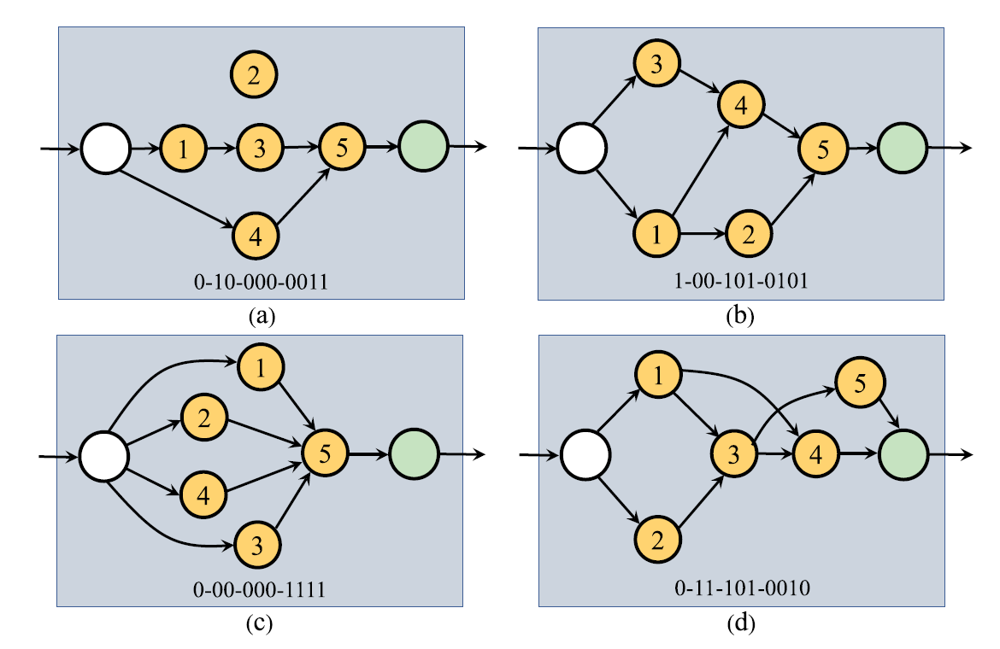

Genetic U-net Notes
===
Reresentation
---
$i$ section has $i$ bit. For $i$ section, the bit are the input of $node_{i+1}$ (For internal node)

For the primary input node(white node), it is **connected to nodes with a successor but without a predecessor.**(An yellow node with an output but without an input)

For the primary output node(green node), it is **connected to nodes with a predecessor but withour a successor**(An yellow with an input but without an output)

